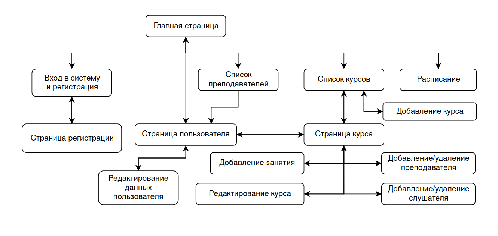

## Содержание
### [Страницы сайта](#страницы)
### [Сценарии использования](#сценарии-использования-1)
### [Схема базы данных](#схема-базы-данных-1)
### [Второй этап](#второй-этап-1)

---
## Страницы:

1. **Главная страница**
    * Ссылки на страницы "Каталог курсов", "Список преподавателей", "Список компаний", "Расписание", "Вход в систему"
    * Кнопка "Личный кабинет" для перехода на страницу текущего пользователя
2. **Вход в систему и регистрация**
    * Поле для ввода логина
    * Поле для ввода пароля
    * Кнопка "Войти": при совпадении данных, введённых пользователем, происходит переход на "Главную страницу".
    * Кнопка "Зарегистрироваться": при нажатии происходит переход на "Страницу регистрации".
3. **Страница регистрации**
    * Поле для ввода ФИО
    * Поле для ввода логина
    * Поле для выбора роли (преподаватель/обучающийся)
    * Поле для ввода пароля
    * Кнопка "Зарегистрироваться": при нажатии происходит создание нового пользователя и переход на страницу 
    "Вход в систему и регистрация"
4. **Страница пользователя**
    * ФИО
    * Дата рождения
    * Роль (преподаватель или обучающийся)
    * Список курсов
    * Кнопка "Редактировать" для редактирования данных пользователя
5. **Список преподавателей**
    * Список имен преподавателей с возможностью перейти на страницу каждого преподавателя.
    * Кнопка для перехода на "Главную страницу".
6. **Список курсов:**
    * Список названий всех курсов с возможностью перейти на страницу каждого курса.
    * Кнопка для перехода на "Главную страницу"
7. **Страница курса**
    * Название
    * Описание курса
    * Список преподавателей
    * Кнопка "Добавить преподавателя"
    * Кнопка "Добавить слушателя"
    * Кнопка "Добавить занятие"
    * Расписание занятий по курсу в виде списка записей вида:\
    <начало> - <конец>: <тема занятия>
    * Список слушателей
8. **Добавление занятия**
    * Поле для ввода времени начала занятия
    * Поле для ввода времени окончания занятия
    * Поле для ввода темы занятия
    * Кнопка "Добавить"
9. **Добавление курса**
    * Поле для ввода названия курса
    * Поле для ввода описания курса
    * Кнопка "Сохранить" для сохранения изменений и перехода на "Страницу курса"
10. **Редактирование курса**
     * Поле для ввода названия курса
     * Поле для ввода описания курса
     * Кнопка "Сохранить" для сохранения изменений и перехода на "Страницу курса"
11. **Добавление/удаление преподавателя**
    * Поле с выбором преподавателя
    * Кнопка "Добавить"
    * Кнопка "Удалить"
12. **Добавление/удаление слушателя**
    * Поле с выбором обучающегося
    * Кнопка "Добавить"
    * Кнопка "Удалить"
13. **Редактирование пользователя**
    * Поле для ввода ФИО
    * Поле для ввода логина
    * Кнопка "Сохранить" для сохранения изменений и перехода на "Страницу пользователя"
14. **Расписание**
    * Поле для выбора пользователя
    * Поле для выбора начала временного интервала
    * Поле для выбора конца временного интервала
    * Кнопка "Показать расписание": по введенным данным система выводит пользователю расписание.
    * Кнопка для перехода на "Главную страницу"
---
## Сценарии использования:
1. **Получение списка всех преподавателей, зарегистрированных в системе**
    * Пользователь заходит на сайт и попадает на главную страницу. С этой страницы он переходит на страницу
      "Список преподавателей".
2. **Получение списка всех курсов**
    * Пользователь заходит на сайт и попадает на главную страницу. С этой страницы он переходит на страницу
      "Список курсов".
3. **Добавление курса**
    * Пользователь заходит на сайт и попадает на главную страницу. С этой страницы он переходит на страницу
      "Список курсов".
    *  На странице "Список курсов" пользователь нажимает кнопку "Добавить курс" и переходит на страницу
       "Добавление курса".
    * На странице "Добавление курса" пользователь вводит необходимую информацию и нажимает кнопку "Сохранить".
4. **Просмотр информации о курсе, списка преподавателей и слушателей курса**
    * Пользователь заходит на сайт и попадает на главную страницу. С этой страницы он переходит на страницу
      "Список курсов".
    * Со страницы "Список курсов" по выбранному курсу пользователь переходит на "Страницу курса", на которой
      находит всю необходимую информацию о курсе, его преподавателях и слушателях.
5. **Добавление/удаление преподавателя курса**
    * Для добавления нового преподавателя на "Странице курса" пользователь нажимает кнопку
      "Добавить преподавателя", после чего переходит на страницу "Добавление/удаление преподавателя".
    * На странице "Добавление или удаление преподавателя" пользователь выбирает в форме нужного пользователя и
      нажимает кнопку "Добавить" для добавления слушателя на курс, кнопку "Удалить" -- для удаления.
6. **Добавление/удаление слушателя курса**
    * Для добавления/удаления слушателя на "Странице курса" пользователь нажимает кнопку
      "Добавить слушателя", после чего переходит на страницу "Добавление/удаление слушателя".
    * На странице "Добавление или удаление слушателя" пользователь выбирает в форме нужного пользователя и
      нажимает кнопку "Добавить" для добавления слушателя на курс или кнопку "Удалить" -- для удаления.
7. **Редактирование информации по курсу**
    * На странице "Список курсов" пользователь выбирает интересующий его курс и заходит на его страницу.
    * Далее на "Странице курса" пользователь нажимает кнопку "Редактировать курс" и переходит на страницу
      "Редактирование курса".
    * На странице "Редактирование курса" пользователь изменяет информацию по курсу и нажимает кнопку "Сохранить".
8. **Добавление занятия для курса**
    * На странице "Список курсов" пользователь выбирает интересующий его курс и заходит на его страницу.
    * Далее на "Странице курса" пользователь нажимает кнопку "Добавить занятие", после чего переходит на страницу
      "Добавление занятия" и заполняет форму информацией о занятии:
      время начала, время окончание, тема. После чего нажимает кнопку "Добавить".
9. **Просмотр расписания пользователя**
    * Пользователь заходит на сайт и попадает на главную страницу. С этой страницы он переходит на страницу
      "Расписание".
    * На странице "Расписания" пользователь выбирает нужного пользователя, нужный временной интервал и нажимает кнопку
      "Показать расписание". После чего на этой странице ему выводится расписание выбранного пользователя за
      определенный интервал времени.
10. **Редактирование информации о пользователе**
    * Пользователь заходит на сайт и попадает на главную страницу. На этой страницы он нажимает кнопку "Личный кабинет"
      и переходит на свою "Страницу пользователя".
    * На "Странице пользователя" нажимает кнопку "Редактировать" и переходит на страницу "Редактирование пользователя".
    * На странице "Редактирование пользователя" пользователь вводит данные и нажимает кнопку "Сохранить".
---
## Схема базы данных:

---
## Второй этап:
[Реализация DAO-классов](src/main/java/ru/webprac/DAO)

[Тестирование DAO-классов](src/test/java/ru/webprac/DAOTests.java)
### Результаты тестирования:

